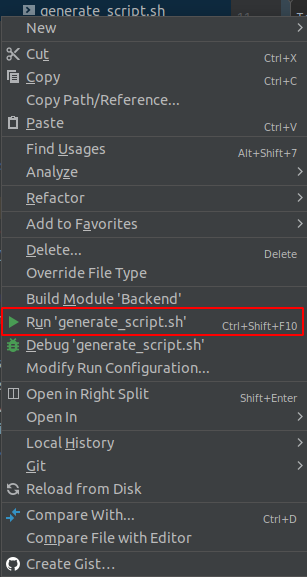

#Web Application

##About the project

####This is an application meant for students at the Faculty of Computer Science & Engineering in Skopje, through this application they will be able to share their study materials and to have easier and more productive study time.
####For implementation, we used SpringBoot for backend, React.js for frontend and PostgreSQL for database.
####The link where this project is demonstrated: [Link to the video](https://youtu.be/SQYnNBBxF6k)


##How to run the script
To initialize data in the database you need to run a script. Firstly you should create postgres database and in the console of the database execute the following commads:

````shell
create schema if not exists auth_user;
````

Now to run the script choose one of the following options.
1. One way is to open terminal in the root directory and write the following commands:

````shell
cd src/main/java/com/example/backend/database_definition
sh generate_script.sh
psql -U postgres -d web_proekt_baza -h localhost -p 5432 -f initialization_script.sql
````

2. Another way is to:
<li>Go to the following directory: "src/main/java/com/example/backend/database_definition"</li>
<li>Right Click on "generate_script.sh"</li>
<li>Click 'Run generate_script.sh'</li>



<li>Open the newly created sql script (initialization_script.sql) located in the same directory</li>
<li>Copy the whole file</li>
<li>Right click on the data base and click 'Jump to query console' (click whatever after that)</li>
<li>Paste the code you copied</li>
<li>Click the 'Run' button at the top left corner</li>

###And you are ready to go!


